# Welcome to the Makerthon - Raspberry Pi Pico
## Micropython
**MicroPython** is a full implementation of the Python 3 programming language that runs directly on embedded hardware like Raspberry Pi Pico. 
You get an interactive prompt (the REPL) to execute commands immediately via USB Serial, and a built-in filesystem. 
The Pico port of MicroPython includes modules for accessing low-level chip-specific hardware.
## How to install Micropython onto your Raspberry Pi Pico
### Requirements:
- Raspberry Pi Pico
- USB Cable
- Thonny IDE Software
- Micropython UF2 file
### Installing Micropython into Raspberry Pi Pico
1. Click [here](https://micropython.org/download/rp2-pico/rp2-pico-latest.uf2) to download micropython UF2 file for the board.
2. Hold the BOOTSEL button on your Raspberry Pi Pico and connect your pico to your computer via USB (Do not release the button)
3. Release the button after pico is connected
4. It will mount as a Mass Storage Device called RPI-RP2.
5. Drag and drop the MicroPython UF2 file onto the RPI-RP2 volume. Your Pico will reboot. You are now running MicroPython.
6. You can access the REPL via USB Serial.
##  Thonny
**Thonny** is an integrated development environment (IDE) for Python that is designed for beginners. 
It supports different ways of stepping through the code, step-by-step expression evaluation, detailed visualization of the call stack and a mode for explaining the concepts of references and heap.

An **IDE** is software that gives its users an environment for performing programming, along with development as well as testing and debugging the application.
### Installing and setting up Thonny
1. Click [here](https://thonny.org/) to download the IDE version for your specific operating system.
2. If you are on linux use the commands below to install Thonny:
- `sudo apt install python3 python3-pip python3-tk` 

When opening Thonny for the first time, select **Standard Mode**. For some versions this choice will be made via a popup when you first open Thonny. 
However for the Raspberry Pi release you should click on the text in the top right of the window to switch to **Regular Mode**. 
Make sure your Raspberry Pi Pico is plugged into your computer and click on the word **Python** followed by a version number at the bottom-right of the Thonny window — this is the Python interpreter that Thonny is currently using. 
Normally the interpreter is the copy of Python running on Raspberry Pi, but it needs to be changed in order to run your programs in MicroPython on your Pico, clicking the current interpreter will open a drop down.

Go to run > Select interpreter > Select Micropython (Raspberry Pi Pico) as shown
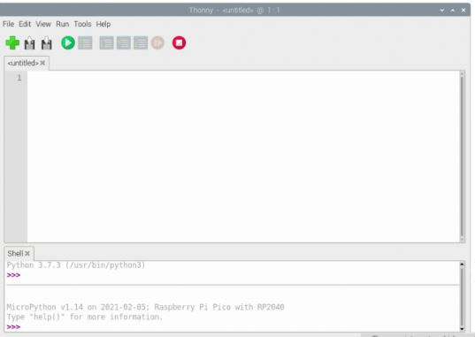

You can now access the REPL from the Shell panel, try and print out a string as shown below.
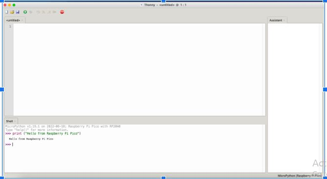

### Blinking the LED from Thonny
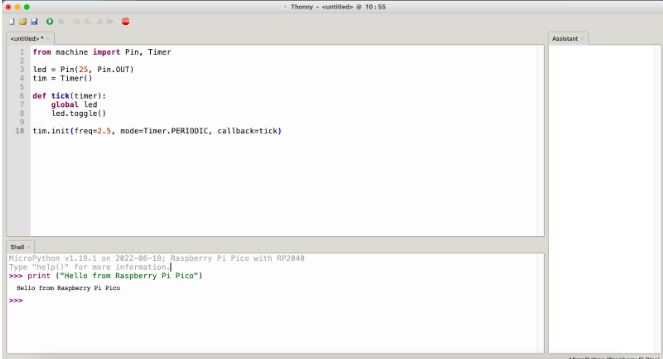

- First save the project on your computer as a “.py” file e.g blinky.py
- Navigate to File >> Save
- Select “This computer” and save
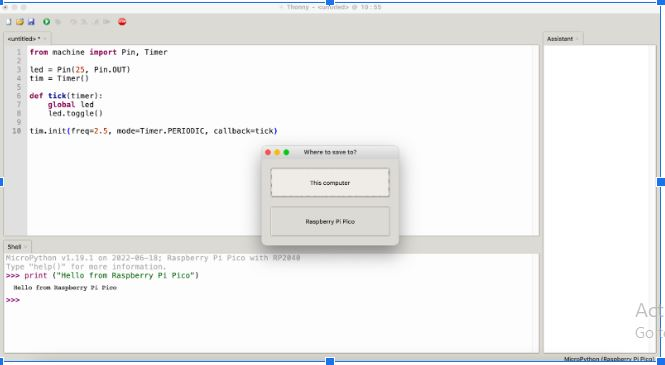

- To save the file onto your Raspberry Pi Pico
- Navigate to File >> Save As
- Select “Raspberry Pi Pico” this time.
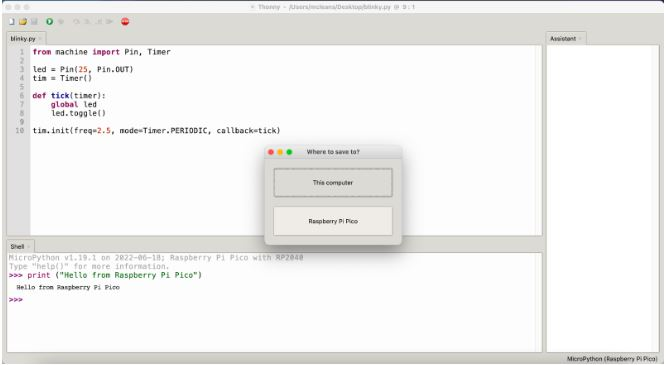

**Note** In order for your program to be executed every time the Pico starts your program has to be saved as “main.py”
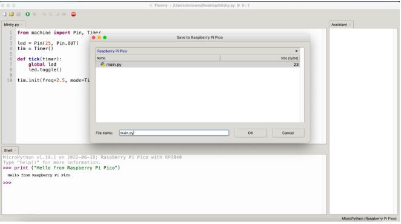

- Click OK
- Remove power from the Pico. When the Pico is powered again the program starts executing automatically.
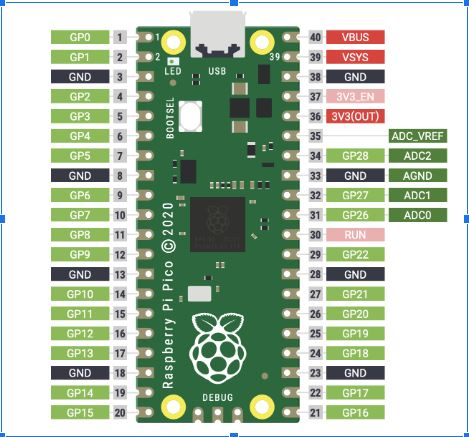

Congratulations your Pico is now running Blinky

### Digital Output
Digital Input and Output is a very useful concept in microcontrollers. It enables the microcontroller to output digital signals to the world and also receive digital signals.

In the example project in the first section we implemented a digital output program.
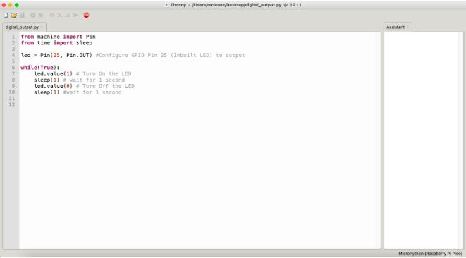

### Digital Input
In order to detect an input signal we have to configure the “Pin” as an input and then read its value. We get a “True” value when the pin is HIGH and a “False” value when the pin is LOW.

We can then use this signal to turn ON and OFF the onboard LED
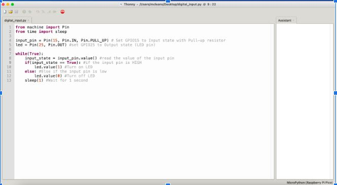

### Analog Input
Analog input pins enable the microcontroller to read continuously changing signals such as sensor data from sensors that produce an analog output. In this example we will connect an analog sensor to an analog pin of the microcontroller and read values from it.

Each team has at least one on the sensors listed below

1. **Analog Microphone**
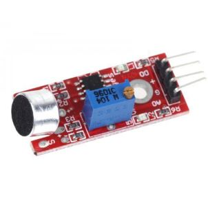

2. **MQ-7 Carbon Monoxide Gas Sensor**
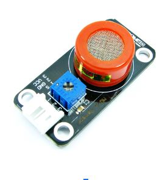

3. **MQ-5 gas sensor (LPG, natural gas, coal gas)**
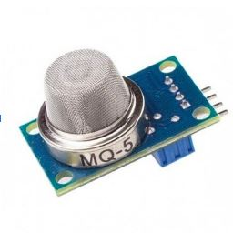

4. **MQ-4 Methane Gas Sensor**
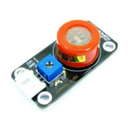

### Connection Instructions
- Connect the sensor’s Vcc pin to the 3V3(OUT) pin on your Pico.
- Connect the sensor’s GND pin to the AGND pin of your Pico
- Connect the sensors DO/Out pin to GPIO26 of your Pico

Use the program below to read the raw sensor analog values using your Pico. 
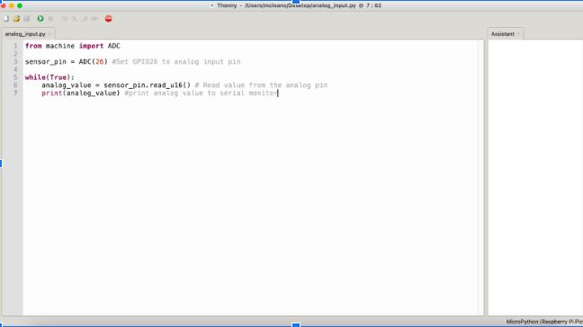

The received analog value is a 16 bit value ranging between (0 - 65535). This value can be used to calibrate the sensor

## Temperature and Humidity data from DHT11
###  Pinout Diagram

### Connection
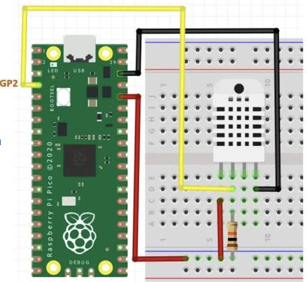

### Sample Code
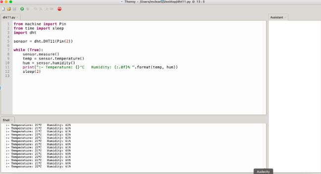

## References
- Raspberry Pi Documentation [link](https://www.raspberrypi.com/documentation/microcontrollers/)
- Raspberry Pi Datasheet [link](https://datasheets.raspberrypi.com/)
- Micropython on Raspberry Pi Pico [link](https://www.raspberrypi.com/documentation/microcontrollers/micropython.html)
- Getting Started with Micropython on Raspberry Pi Pico [link](https://hackspace.raspberrypi.com/books/micropython-pico)

# Gearbox  Academy Students' Portfolios and LinkedIn
1. [Evelyne Otieno](https://evetim123.github.io/)
2. [Ian Kisali](https://iankisali.github.io/)
3. [Alex Kimeu](https://alex-m-kimeu.github.io/)
4. [Francis Gitau](https://francis-gitau.herokuapp.com)
5. [Catherine Nginya](http://www.linkedin.com/in/catherine-nginya-69aa8222b)
6. [Laurine Chepkemoi](http://www.linkedin.com/in/laurine-chepkemoi)

