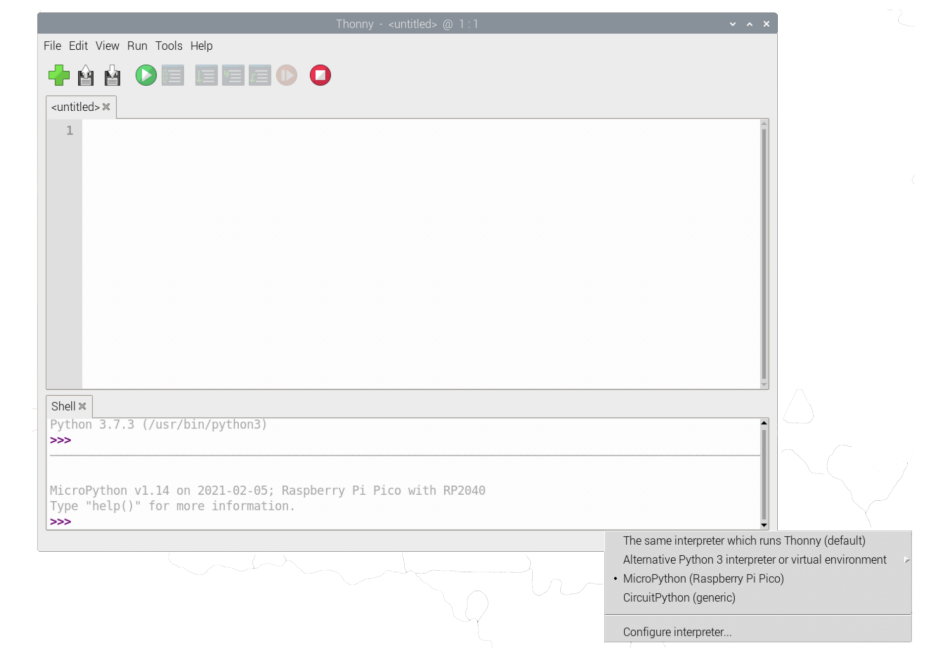

# Welcome to the Makerthon - Raspberry Pi Pico
## Micropython
**MicroPython** is a full implementation of the Python 3 programming language that runs directly on embedded hardware like Raspberry Pi Pico. 
You get an interactive prompt (the REPL) to execute commands immediately via USB Serial, and a built-in filesystem. 
The Pico port of MicroPython includes modules for accessing low-level chip-specific hardware.
## How to install Micropython onto your Raspberry Pi Pico
### Requirements:
- Raspberry Pi Pico
- USB Cable
- Thonny IDE Software
- Micropython UF2 file
### Installing Micropython into Raspberry Pi Pico
1. Click [here](https://micropython.org/download/rp2-pico/rp2-pico-latest.uf2) to download micropython UF2 file for the board.
2. Hold the BOOTSEL button on your Raspberry Pi Pico and connect your pico to your computer via USB (Do not release the button)
3. Release the button after pico is connected
4. It will mount as a Mass Storage Device called RPI-RP2.
5. Drag and drop the MicroPython UF2 file onto the RPI-RP2 volume. Your Pico will reboot. You are now running MicroPython.
6. You can access the REPL via USB Serial.
##  Thonny
**Thonny** is an integrated development environment (IDE) for Python that is designed for beginners. 
It supports different ways of stepping through the code, step-by-step expression evaluation, detailed visualization of the call stack and a mode for explaining the concepts of references and heap.
An **IDE** is software that gives its users an environment for performing programming, along with development as well as testing and debugging the application.
### Installing and setting up Thonny
1. Click [here](https://thonny.org/) to download the IDE version for your specific operating system.
2. If you are on linux use the commands below to install Thonny:
- `sudo apt install python3 python3-pip python3-tk` 

When opening Thonny for the first time, select *Standard Mode*. For some versions this choice will be made via a popup when you first open Thonny. 
However for the Raspberry Pi release you should click on the text in the top right of the window to switch to *Regular Mode*. 
Make sure your Raspberry Pi Pico is plugged into your computer and click on the word *Python* followed by a version number at the bottom-right of the Thonny window — this is the Python interpreter that Thonny is currently using. 
Normally the interpreter is the copy of Python running on Raspberry Pi, but it needs to be changed in order to run your programs in MicroPython on your Pico, clicking the current interpreter will open a drop down.

Go to run > Select interpreter > Select Micropython (Raspberry Pi Pico) as shown

You can now access the REPL from the Shell panel, try and print out a string as shown below.

#Blinking the LED from Thonny

.First save the project on your computer as " .py" file e.g blinky .py
.Navigate to file >> Save
.Select "This Computer " and save.

